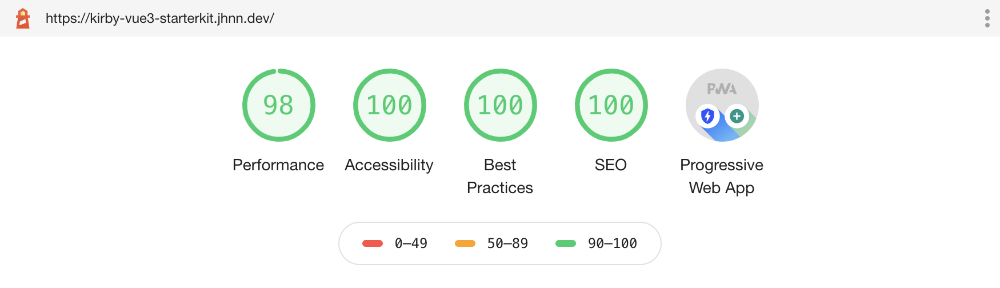
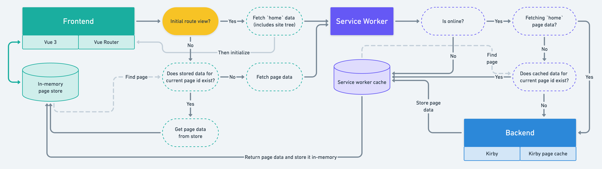

<p align="center">
  
</p>

<h3 align="center">Kirby + Vue.js Starterkit</h3>

<p align="center">
  SPA with Vue 3 and Kirby: SEO-friendly, automatic routing, mulit-lang-ready and more!<br>
  <a href="https://kirby-vue3-starterkit.jhnn.dev"><strong>Explore the starterkit live »</strong></a>
</p>

<br>

## Kirby + Vue.js Starterkit

### Key Features

- 🛣 Automatic routing
- 🔍 SEO-friendly: [server-side generated](site/snippets/meta.php) meta tags
- 🌐 [Multi-language support](#multi-language)
- ♿ Accessible frontend routing
- 🚝 [Offline-first](#caching--offline-capability-with-service-worker)
- 💫 [Stale-while-revalidate](#stale-while-revalidate) page data
- ⚡️ [Vite](https://github.com/vitejs/vite) instead of Vue CLI
- 🤝 Shared [`.env`](.env.example) for frontend & backend
- 🚀 Modern folder structure

### Introduction

> [Or jump right to the setup](#setup).

This project is a starting point for [Vue.js 3](https://github.com/vuejs/vue-next) as the frontend UI library and [Kirby](https://getkirby.com) as headless CMS. The content is provided as JSON through Kirby and fetched by the frontend.

It's a simple, zero-setup, almost identical port of the [Kirby 3 starterkit](https://github.com/getkirby/starterkit) frontend (snippets, templates and their corresponding JS/CSS) to Vue.js single file components. By "almost" meaning that some features have been added like meta tags generation, environment variables support, accessible routing etc.

To compile the frontend sources, [Vite](https://vitejs.dev) comes to use. Vite is an opinionated web development build tool, created by Evan You. It serves code via native ES Module imports during development, allowing you to develop Vue.js single file components without a bundle step, and bundles it with Rollup for production.

### Lighthouse Report



### Folder Structure

Some notes about the folder structure with some additional comments on important files.

<details>
<summary><b>Expand folder tree</b></summary>

```sh
kirby-vue3-starterkit/
|
|   # Main entry point of the website, point your web server to this directory
├── public/
|   |
|   |   # Frontend assets generated by Vite (not tracked by Git)
|   ├── dist/
|   |
|   |   # Static images like icons
|   ├── img/
|   |
|   |   # Kirby's media folder for thumbnails and more (not tracked by Git)
|   └── media/
|
|   # Various development-related Node scripts
├── scripts/
|   |
|   |   # Service worker generator
|   └── buildServiceWorker.js
|
|   # Kirby's core folder containing templates, blueprints, snippets etc.
├── site/
|   ├── blueprints/
|   ├── config/
|   |   |
|   |   |   # General configuration settings for Kirby and plugins
|   |   ├── config.php
|   |   |
|   |   |   # Builds a JSON-encoded `site` object for the frontend
|   |   |   # Used by Vue Router to populate routes, but can be extended by commonly used data
|   |   └── app-site.php
|   |
|   |   # Only relevant in multi-language setups
|   ├── languages/
|   |
|   ├── models/
|   ├── plugins/vite/
|   |   |
|   |   |   # Core of the Vite integration plugin, mainly registeres routes
|   |   ├── index.php
|   |   |
|   |   |   # Routes to handle `.json` requests and serving the `index.php` snippet
|   |   └── routes.php
|   |
|   |   # Templates for JSON content representations fetched by frontend
|   |   # Contains also index page (`_app-index.php`)
|   └── templates/
|       |
|       |   # Handles build asset paths, inlines the `site` object, includes SEO meta tags, etc.
|       └── _app-index.php
|
|   # Includes all frontend-related sources
├── src/
|   |
|   |   # `Header`, `Footer`, `Intro` and other components
|   |   # (Vue.js components correspond to Kirby snippets)
|   ├── components/
|   |
|   |   # Hooks for common actions
|   ├── hooks/
|   |   |
|   |   |   # Announces any useful information for screen readers
|   |   ├── useAnnouncer.js
|   |   |
|   |   |   # Provides information about the current language
|   |   ├── useLanguages.js
|   |   |
|   |   |   # Retrieves pages from the content API
|   |   ├── useKirbyApi.js
|   |   |
|   |   |   # Returns page data for the current path, similarly to Kirby's `$page` object
|   |   ├── usePage.js
|   |   |
|   |   |   # Various service worker methods like registering
|   |   ├── useServiceWorker.js
|   |   |
|   |   |   # Returns a object corresponding to Kirby's global `$site`
|   |   └── useSite.js
|   |
|   |   # Custom Vue plugins
|   ├── plugins/
|   |   |
|   |   |   # Adds a `v-kirbytext` directive to handle internal page links inside KirbyText
|   |   └── KirbyTextDirective.js
|   |
|   |   # Vue Router related methods and exports
|   ├── router/
|   |   |
|   |   |   # Initializes and exports the router instance
|   |   ├── index.js
|   |   |
|   |   |   # Handles the router's scroll behaviour
|   |   └── scrollBehaviour.js
|   |
|   |   # Vue.js views corresponding to Kirby templates
|   |   # Routes are being automatically resolved
|   ├── views/
|   |
|   ├── App.vue
|   ├── index.css
|   ├── index.js
|   └── serviceWorker.js
|
|   # Contains everything content and user data related (not tracked by Git)
├── storage/
|   ├── accounts/
|   ├── cache/
|   ├── content/
|   ├── logs/
|   └── sessions/
|
|   # Kirby CMS and other PHP dependencies (handled by Composer)
├── vendor/
|
|   # Environment variables for both Kirby and Vite (to be duplicated as `.env`)
├── .env.example
|
|   # Handles PHP dependencies
├── composer.json
|
|   # Handles npm dependencies
├── package.json
|
|   # Router for the PHP built-in development server (used by `serveKirby.js`)
├── server.php
|
|   # Configuration file for Vite
└── vite.config.js
```

</details>

## Caching & Offline Capability With Service Worker

Even without a service worker installed, the frontend will store pages between indiviual routes/views. When you reload the tab, the data for each page is freshly fetched from the API once again.

For offline capability of your Vue app, you can choose to activate the included [service worker](src/serviceWorker.js).

A visual explanation of both methods can be found in the following flow chart:



The service worker precaches all CSS & JS assets required by the Vue app and caches the data of every requested page. All assets are versioned and served from the service worker cache directly.

Each JSON request will be freshly fetched from the network and saved to the cache. If the user's navigator turns out to be offline, the cached page request will be returned.

## Stale-While-Revalidate

The stale-while-revalidate mechanism for the [`usePage`](src/hooks/usePage.js) hook allows you to respond as quickly as possible with cached page data if available, falling back to the network request if it's not cached. The network request is then used to update the cached page data – which directly affects the view after lazily assigning changes (if any), thanks to Vue's reactivity.

## Prerequisites

- Node.js with npm (only required to build the frontend)
- PHP 7.4+

> Kirby is not a free software. You can try it for free on your local machine but in order to run Kirby on a public server you must purchase a [valid license](https://getkirby.com/buy).

## Setup

### Composer

Kirby-related dependencies are managed via [Composer](https://getcomposer.org) and located in the `vendor` directory. Composer dependencies are tracked in this repository by default. Thus, no installation of Composer and executing `composer install` is required.

Update dependencies with:

```bash
composer update
```

### Node dependencies

Install npm dependencies:

```bash
npm install
```

### Environment variables

Duplicate the [`.env.example`](.env.example) as `.env`::

```bash
cp .env.example .env
```

Optionally, adapt it's values.

### Static assets

*During development* Kirby can't access static files located in the `src` folder. Therefore it's necessary to create a symbolic link inside of the public folder:

```bash
ln -s $PWD/src/assets ./public/assets
```

## Usage

### Development

You can start the development process with:

```bash
# Runs `npm run kirby` parallel to `vite`
npm run dev
```

Afterwards visit the app in your browser: [`http://127.0.0.1:8080`](http://127.0.0.1:8080)

> For Valet users: Of course you can use a virtual host alternatively!

Vite is used in combination with [backend integration](https://vitejs.dev/guide/backend-integration.html) and only serves frontend assets, not the whole app. Thus, `http://localhost:3000` won't be accessible.

The backend is served by the PHP built-in web server on `http://127.0.0.1:8080` by default, but you can adapt the location in your `.env` file.

> During development a `.lock` file will be generated inside the `src` folder to let the backend now which mode the app runs in: development or production. This file is deletetd when running the build command.

### Production

Build optimized frontend assets to `public/dist`:

```bash
npm run build
```

Vite will generate a hashed version of all assets, including images and fonts saved inside `src/assets`. It will further create a `manifest.json` file with hash records etc.

### Deployment

1. Deploy the repository on your server.
2. Duplicate [`.env.example`](.env.example) as `.env`.
3. Install npm dependencies and build frontend assets: `npm i && npm run build`.
4. Change variables in your `.env`:
   - `KIRBY_DEBUG` to `false`
5. Point your web server to the `public` folder.
6. Some hosting environments require to uncomment `RewriteBase /` in [`.htaccess`](public/.htaccess) to make site links work.

Now your project is hopefully up 'n' running!

## Configuration

All development and production related configurations for both backend and frontend code are located in your `.env` file:
- `KIRBY_DEV_HOSTNAME` and `KIRBY_DEV_PORT` specify the address where you wish the Kirby backend to be served from. It is used by the frontend to fetch content data as JSON.
- Keys starting with `VITE_` are available in your code following the `import.meta.env.VITE_CUSTOM_VARIABLE` syntax.

For example setting `KIRBY_CACHE` to `true` is useful in production environment.

### Content API Slug

To change the API slug to fetch JSON-encoded page data from, set
- `CONTENT_API_SLUG` to a value of your liking (defaults to `spa`). It can even be left empty to omit a slug altogether!

> You can't use Kirby's internal API slug (defaults to `api`). If you insist on using `api` for *your* content endpoint, you can rename Kirby's by adding a `KIRBY_API_SLUG` key and set it to something other than `api`.

### Multi-Language

Multiple languages are supported. A comprehensive introduction about [multi-language setups](https://getkirby.com/docs/guide/languages/introduction) may be found on the Kirby website.

To enable language handling, you don't have to edit the [`config.php`](site/config/config.php) manually. Just set
- `KIRBY_MULTILANG` to `true`.
- `KIRBY_MULTILANG_DETECT` to `true` (optional but recommended).

Then, visit the panel and add new languages by your liking. The Panel **automatically renames all existing content** and file meta data files and includes the language extension.

Language data is provided by the global `site` object, which can be accessed via the `useSite()` hook.

ℹ️ **Current limitations**:
- Custom language paths aren't supported as of right now, the language code defined will be used as a base in the frontend.
- Automatic language detection only works in production environment. In development the fallback language is always the default language.

### Service Worker

To enable the **service worker** which precaches essential assets and page API calls for offline capability, set:
- `VITE_SERVICE_WORKER` to `true`

> ⚠️ Don't change the `CONTENT_API_SLUG` once you deployed your app publicly and thus a service worker is installed on clients. Otherwise fetch requests will fail and a blank page will show until the new service worker is activated, which then is only possible by closing the tab/PWA.

### Stale-While-Revalidate

To keep page data fresh with **stale-while-revalidate**, set:
- `VITE_STALE_WHILE_REVALIDATE` to `true`

## Credits

- Huge thanks to [arnoson](https://github.com/arnoson) for his [Kirby Vite Plugin](https://github.com/arnoson/kirby-vite).
- Thanks to Jakub Medvecký Heretik for his inspirational work on [kirby-vue-starterkit](https://github.com/jmheretik/kirby-vue-starterkit) which got me starting to build my own Kirby Vue integration.

## License

[MIT](https://opensource.org/licenses/MIT)

It is discouraged to use this starterkit in any project that promotes racism, sexism, homophobia, animal abuse, violence or any other form of hate speech.
