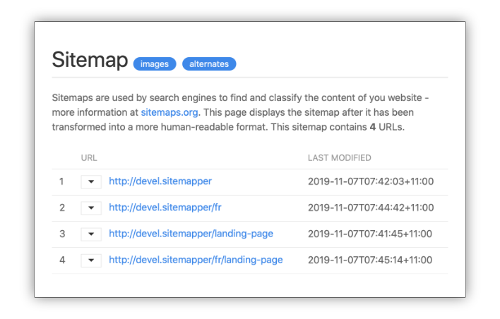

# Cre8iv Sitemapper: auto-generated sitemaps for Kirby 3

The Cre8iv Sitemapper is a plugin we created at [Cre8iv Click](https://cre8iv.click), to auto-generate syntactically-correct xml sitemaps for our clients' Kirby websites. Sitemaps are used by search engines to find and catalogue the content of your site - and hopefully help your site rankings!



Here is what you need to know about Sitemapper:

* It makes the sitemap automatically available at _https://yoursite.com/sitemap.xml_. It will also try to guess when a visitor/bot enters a wrong url - such as _http://yoursite.com/en/sitemap.xml_ - and will automatically redirect them to the correct address.
* It uses a nice, customisable stylesheet to display the site in a human-readable format, if accessed on a browser. You can also customise/localise all strings shown in the in-browser sitemap.
* It allows you to carefully control which pages get added to - and excluded from - the sitemap. You can control it via a blueprint option, via a field on individual pages, or by using a custom filtering function.
* You can also control which images get added to the sitemap, and to which pages. You can control it via a bluprint option, and via a field on the individual image content page.
* It maps pages correctly on multilingual sites, whether the page is multilingual or single-language.
* If you're still not happy, Sitemapper allows you to build your own custom mapping function from scratch - useful for advanced sites that use [custom routes](https://getkirby.com/docs/guide/routing) and/or [virtual pages](https://getkirby.com/docs/guide/virtual-pages).

****

## Installation

### Manual Download
You can simply download and copy this repository to `/site/plugins/sitemapper`.

### Git Submodule
You can add Sitemapper to your project as a git submodule, with this command:

```
git submodule add https://gitlab.com/cre8ivclick/sitemapper.git site/plugins/sitemapper
```

### Composer
If you use composer, you can quickly add Sitemapper to your project like this:
```
composer require cre8ivclick/sitemapper
```

****

## Documentation
Complete documentation for installing, configuring and using Sitemapper can be found in the [wiki area](https://gitlab.com/cre8ivclick/sitemapper/wikis/home) of this project.


****

## Contributing
Please use the 'Issues' page of this project to report any bugs you find, and post ideas and feature requests.

We have tried to keep the code in the plugin reasonably simple, organised and well-commented. Feel free to fork this project, and send enhancements and bug fixes via merge requests. Please be aware, that we aim to keep the plugin _simple_ and _easy to maintain_.

## To-Do
* list a site's video content
* include optional 'changefreq' and 'priority' tags for sitemap entries

## License

Sitemapper is released under the MIT License - see the 'LICENSE.md' file included in this repository for full license text.

## Credits

The Cre8iv Sitemapper is developed by [Cre8iv Click](https://cre8iv.click), but we stand on the shoulder of giants:

* the code was started by extending [this Cookbook recipe](https://getkirby.com/docs/cookbook/content/sitemap) in the excellent Kirby Docs
* the stylesheet is based on work done by [Alan Wu](https://github.com/catcto/sitemap-stylesheet)
* some of the logic was based on previous sitemap work done by [David Somers](https://github.com/omz13/kirby3-xmlsitemap)

Styling of the sitemap is done using the amazing [UIKit](https://getuikit.com) frontend framework.

